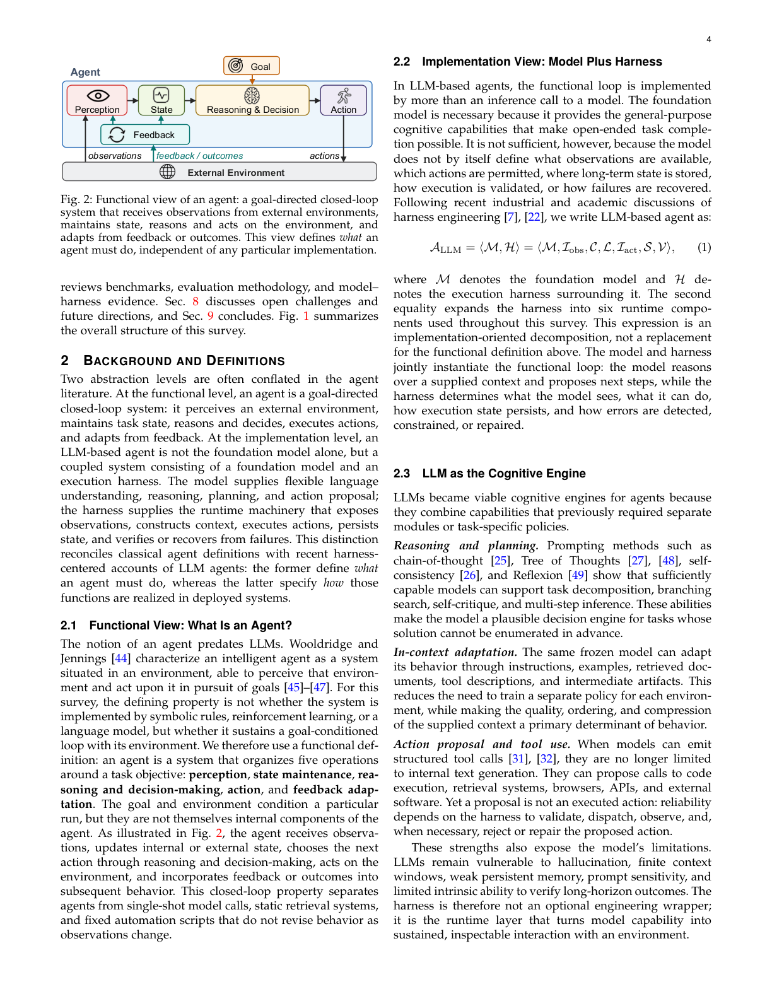
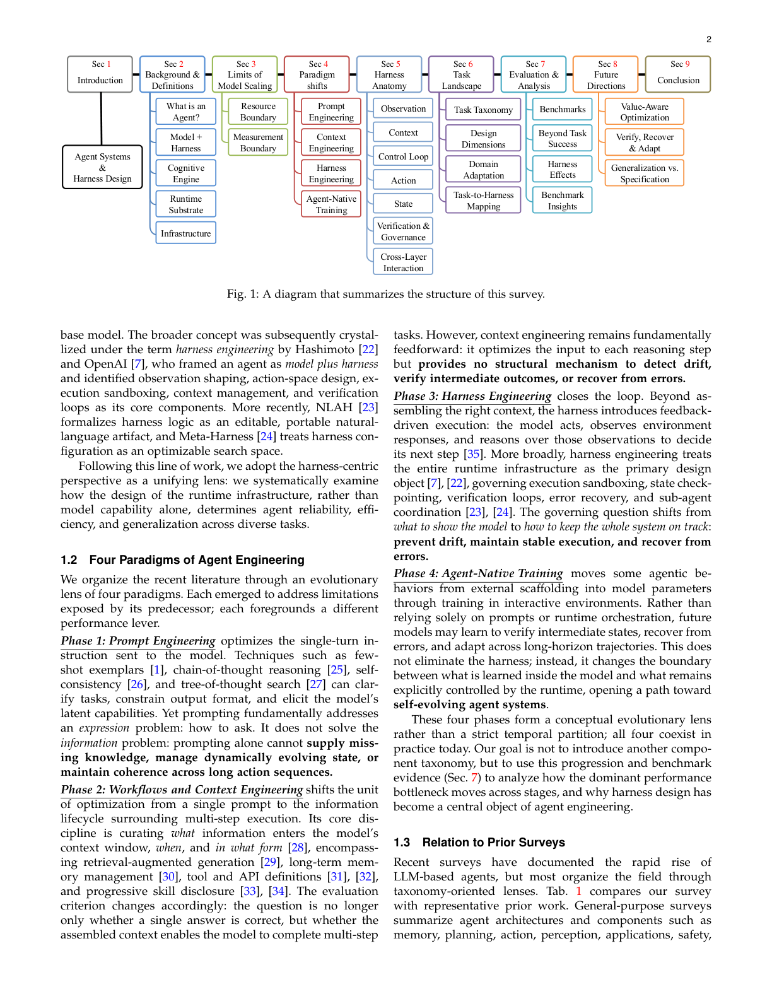
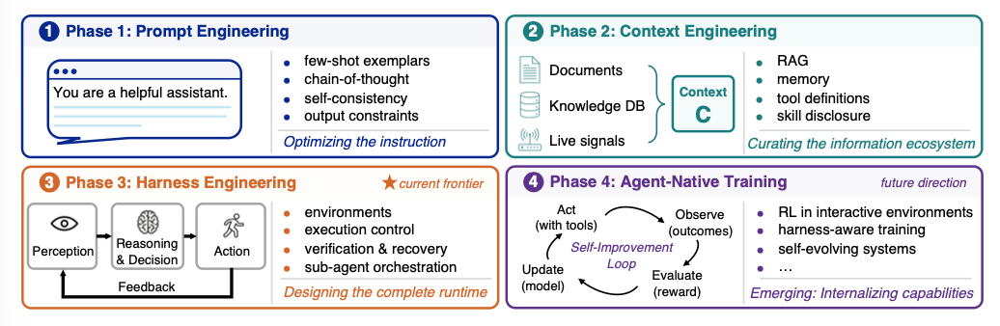
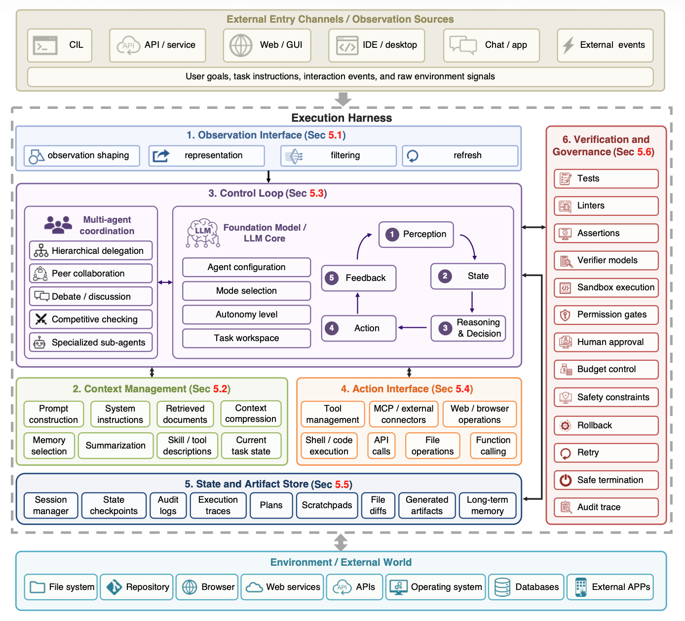
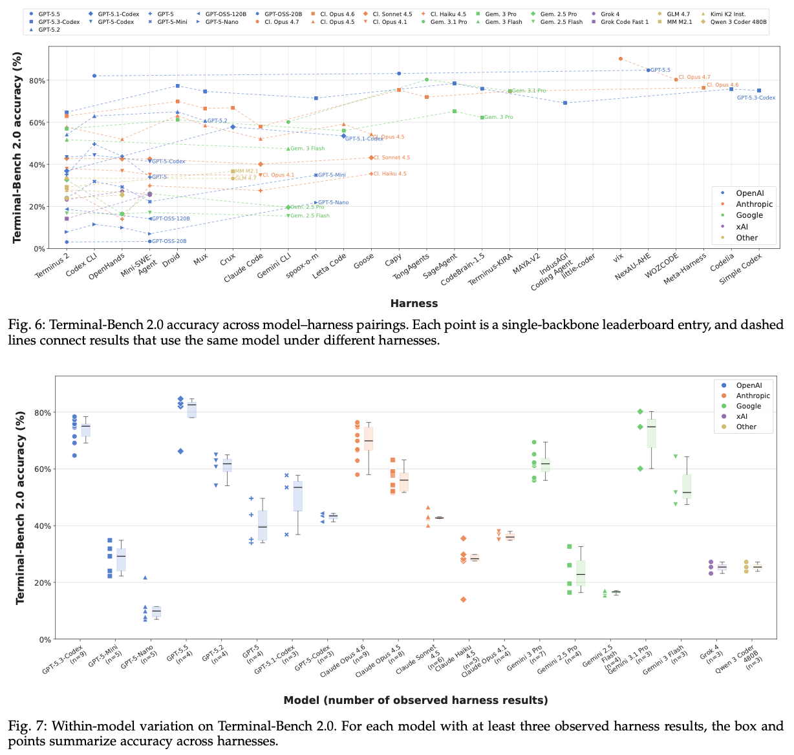

<h1 align="center">From Question Answering to Task Completion:<br/>A Survey on Agent System and Harness Design</h1>

<p align="center">
  <a href="./Agent_Harness_Survey.pdf"></a><a href="./LICENSE"></a>
</p>

> This repo is used for recording, tracking, and organizing papers, systems, benchmarks, and other resources on **LLM-based agent system and harness design**, as a supplement to our survey.
>
> If you find any work missing or have any suggestions (papers, implementations, and other resources), feel free to open pull requests. We will add the missing entries to this repo ASAP.
>
> 📄 **[Read the survey (PDF)](./Agent_Harness_Survey.pdf)**
>
> ✉️ Corrections & suggestions: [jianyuan_guo@outlook.com](mailto:jianyuan_guo@outlook.com) (Jianyuan Guo)

---

## 📰 News

- **[2026.06]** Repository and Survey released.

---

## 📚 Table of Contents

- [Overview](#-overview)
- [Survey Structure](#-survey-structure)
- [Four Paradigms of Agent Engineering](#-four-paradigms-of-agent-engineering)
- [Execution Harness Anatomy](#-execution-harness-anatomy)
- [Paper List](#-paper-list)
  - [Foundational Papers (Survey Mainline)](#foundational-papers-survey-mainline)
  - [Surveys and Meta-analyses](#surveys-and-meta-analyses)
  - [Prompting, Reasoning, and Planning](#prompting-reasoning-and-planning)
  - [Workflow, Tool Use, and Agent Frameworks](#workflow-tool-use-and-agent-frameworks)
  - [Harness, Runtime, Memory, and Protocols](#harness-runtime-memory-and-protocols)
  - [Benchmarks, Evaluation, and Safety](#benchmarks-evaluation-and-safety)
  - [Domain Agents](#domain-agents)
  - [Agent-Native Training and RL](#agent-native-training-and-rl)
  - [Other High-Relevance Systems and Reports](#other-high-relevance-systems-and-reports)
- [Representative Systems](#-representative-systems)
- [Benchmarks at a Glance](#-benchmarks-at-a-glance)
- [Value-Aware Evaluation](#-value-aware-evaluation)
- [Contributing](#-contributing)
- [Citation](#-citation)
- [License](#-license)

---

## 🎯 Overview

LLM-based agents are moving from passive **question answering** to active **task completion**. They perceive environments, invoke tools, maintain state, recover from errors, and act over extended horizons.

The central question of our survey is:

> When agentic tasks remain unreliable, is the bottleneck primarily the foundation model, or the runtime system surrounding it?

We argue that agent quality emerges from the interaction between:

| Factor | What it governs |
| --- | --- |
| **Model capability** | Reasoning, perception, planning, instruction following |
| **Runtime infrastructure** | Tools, context, memory, state, sandboxing, verification, recovery |
| **Task structure** | Horizon, environment, observability, oracle strength, risk |
| **Evaluation design** | Success criteria, cost, latency, safety, trace quality |

Instead of treating agents as models with auxiliary tools, we view an LLM-based agent as:

```text
Agent = Foundation Model + Execution Harness
```

The execution harness is the runtime system that determines what the model observes, which actions it can take, how state persists, how failures are detected, and how outcomes are verified.

<p align="center">
  
  <br/>
  <em>Functional view of an agent: perception, state, reasoning, action, and feedback adaptation.</em>
</p>

---

## 🗺️ Survey Structure

<p align="center">
  
  <br/>
  <em>Structure of our survey: from background and paradigm shifts to harness anatomy, tasks, evaluation, and future directions.</em>
</p>

📄 **[Read the full survey (PDF)](./Agent_Harness_Survey.pdf)**

---

## 🔄 Four Paradigms of Agent Engineering

Our survey organizes the field along four engineering paradigms — from eliciting behavior to internalizing it:

| Paradigm | Core Question | Main Lever | Typical Limitation |
| --- | --- | --- | --- |
| **Prompt Engineering** | How should we ask the model? | Instructions, exemplars, reasoning prompts | Does not manage state, tools, or recovery |
| **Workflow & Context Engineering** | What information should enter the model context? | Retrieval, memory, tool definitions, context compression | Mostly feedforward; weak recovery and verification |
| **Harness Engineering** | How do we keep the whole system on track? | Runtime loop, sandbox, state, tools, verifiers, rollback | Requires task-specific engineering and evaluation |
| **Agent-Native Training** | What agentic behavior should be internalized into the model? | RL, trajectory learning, tool-use training, self-evolution | Still requires harnesses for data, verification, and governance |

<p align="center">
  
  <br/>
  <em>Four paradigms of agent engineering: prompt → context → harness → agent-native training.</em>
</p>

---

## 🏗️ Execution Harness Anatomy

The harness is decomposed into **six runtime responsibilities** that jointly determine whether model capability becomes reliable task completion:

| Component | Role in Agent Systems |
| --- | --- |
| **Observation Interface** | Converts environment state into model-usable observations |
| **Context Manager** | Selects, compresses, retrieves, and formats information |
| **Control Loop** | Decides when to plan, act, verify, retry, stop, or escalate |
| **Action Interface** | Exposes tools, APIs, browser/GUI controls, shell commands, or robot actions |
| **State and Artifact Store** | Persists memory, logs, files, checkpoints, traces, and intermediate outputs |
| **Verification and Governance** | Checks correctness, safety, permissions, policy compliance, and recovery |

<p align="center">
  
  <br/>
  <em>Implementation view: foundation model coupled with a six-component execution harness.</em>
</p>

### Task-to-Harness Pressure Mapping

| Task Property | Failure Pressure | Harness Response |
| --- | --- | --- |
| Long horizon | State drift and context loss | Checkpoints, summaries, artifacts, memory |
| Partial observability | Hidden or indirect state | Structured observations and grounding |
| Strong oracle | Checkable outcomes | Verifier loops and repair cycles |
| Weak or delayed oracle | Uncertain success | Provenance, review, approval, conservative stopping |
| Irreversible actions | Persistent side effects | Sandbox, gates, rollback, permissions |
| High autonomy / low latency | Limited human correction | Budgets, controllers, logging, escalation |

---

## 📖 Paper List

> Papers are formatted as: **_Title_**, Author et al., venue badge, optional GitHub badge.
> Badge colors: `red` = arXiv, `blue` = conference/journal, `lightgrey` = blog/report.


### Foundational Papers (Survey Mainline)

* **_Language Models are Few-Shot Learners_**, Brown et al., [](https://arxiv.org/abs/2005.14165)
* **_Training Language Models to Follow Instructions with Human Feedback_**, Ouyang et al., [](https://arxiv.org/abs/2203.02155)
* **_Chain-of-Thought Prompting Elicits Reasoning in Large Language Models_**, Wei et al., [](https://arxiv.org/abs/2201.11903)
* **_ReAct: Synergizing Reasoning and Acting in Language Models_**, Yao et al., [](https://arxiv.org/abs/2210.03629)
* **_Reflexion: Language Agents with Verbal Reinforcement Learning_**, Shinn et al., [](https://arxiv.org/abs/2303.11366)
* **_Retrieval-Augmented Generation for Knowledge-Intensive NLP Tasks_**, Lewis et al., [](https://arxiv.org/abs/2005.11401)
* **_Toolformer: Language Models Can Teach Themselves to Use Tools_**, Schick et al., [](https://arxiv.org/abs/2302.04761) [](https://github.com/conceptofmind/toolformer)
* **_SWE-agent: Agent-Computer Interfaces Enable Automated Software Engineering_**, Yang et al., [](https://arxiv.org/abs/2405.15793) [](https://github.com/SWE-agent/SWE-agent)
* **_OpenHands: An Open Platform for AI Software Developers as Generalist Agents_**, Wang et al., [](https://arxiv.org/abs/2407.16741) [](https://github.com/All-Hands-AI/OpenHands)
* **_SWE-bench: Can Language Models Resolve Real-World GitHub Issues?_**, Jimenez et al., [](https://arxiv.org/abs/2310.06770) [](https://github.com/SWE-bench/SWE-bench)
* **_WebArena: A Realistic Web Environment for Building Autonomous Agents_**, Zhou et al., [](https://arxiv.org/abs/2307.13854) [](https://github.com/web-arena-x/webarena)
* **_OSWorld: Benchmarking Multimodal Agents for Open-Ended Tasks in Real Computer Environments_**, Xie et al., [](https://arxiv.org/abs/2404.07972) [](https://github.com/xlang-ai/OSWorld)
* **_Building Effective Agents_**, Anthropic Engineering, [](https://www.anthropic.com/engineering/building-effective-agents)
* **_Effective Harnesses for Long-Running Agents_**, Anthropic Engineering, [](https://www.anthropic.com/engineering/effective-harnesses-for-long-running-agents)
* **_Harness Engineering: Leveraging Codex in an Agent-First World_**, OpenAI, [](https://openai.com/index/harness-engineering/)
* **_Model Context Protocol_**, Anthropic, [](https://modelcontextprotocol.io/introduction)

### Surveys and Meta-analyses

* **_A comprehensive survey of agents for computer use: Foundations, challenges, and future directions_**, Sager et al., [](https://arxiv.org/abs/2501.16150)
* **_Empowering Real-World: A Survey on the Technology, Practice, and Evaluation of LLM-driven Industry Agents_**, Tang et al., [](https://arxiv.org/abs/2510.17491)
* **_A Survey on the Safety and Security Threats of Computer-Using Agents: JARVIS or Ultron?_**, Chen et al., [](https://arxiv.org/abs/2505.10924)
* **_GUI-360: A Comprehensive Dataset and Benchmark for Computer-Using Agents_**, Mu et al., [](https://arxiv.org/abs/2511.04307)
* **_Adaptation of Agentic AI: A Survey of Post-Training, Memory, and Skills_**, Jiang et al., [](https://arxiv.org/abs/2512.16301)
* **_Engineering Reasoning and Instruction (ERI) Benchmark: A Large Taxonomy-driven Dataset for Foundation Models and Agents_**, Naser et al., [](https://arxiv.org/abs/2603.02239)
* **_Beyond Pipelines: A Survey of the Paradigm Shift toward Model-Native Agentic AI_**, Sang et al., [](https://arxiv.org/abs/2510.16720)
* **_Gui-ceval: A hierarchical and comprehensive chinese benchmark for mobile gui agents_**, Li et al., [](https://arxiv.org/abs/2603.15039)
* **_From static templates to dynamic runtime graphs: a survey of workflow optimization for llm agents_**, Yue et al., [](https://arxiv.org/abs/2603.22386)
* **_Toward Reliable Evaluation of LLM-Based Financial Multi-Agent Systems: Taxonomy, Coordination Primacy, and Cost Awareness_**, Nguyen et al., [](https://arxiv.org/abs/2603.27539)
* **_ISD-Agent-Bench: A Comprehensive Benchmark for Evaluating LLM-based Instructional Design Agents_**, Jeon et al., [](https://arxiv.org/abs/2602.10620)
* **_How AI Coding Agents Communicate: A Study of Pull Request Description Characteristics and Human Review Responses_**, Watanabe et al., [](https://arxiv.org/abs/2602.17084)
* **_The Attack and Defense Landscape of Agentic AI: A Comprehensive Survey_**, Kim et al., [](https://arxiv.org/abs/2603.11088)

### Prompting, Reasoning, and Planning

* **_Beyond Local Code Optimization Multi 2603_**, Unknown et al., [](https://arxiv.org/abs/2603.14703)
* **_TRACE: A Multi-Agent System for Autonomous Physical Reasoning for Seismology_**, Liu et al., [](https://arxiv.org/abs/2603.21152)
* **_Quality Driven Agentic Reasoning For 2603_**, Unknown et al., [](https://arxiv.org/abs/2603.11082)
* **_Sage Multi Agent Self Evolution 2603_**, Unknown et al., [](https://arxiv.org/abs/2603.15255)
* **_Brain Inspired Graph Multi Agent 2603_**, Unknown et al., [](https://arxiv.org/abs/2603.15371)
* **_Efficient Failure Management For Multi 2603_**, Unknown et al., [](https://arxiv.org/abs/2603.21522)
* **_Improving Clinical Diagnosis with Counterfactual Multi-Agent Reasoning_**, You et al., [](https://arxiv.org/abs/2603.27820)
* **_Webcot Enhancing Web Agent Reasoning 2505_**, Unknown et al., [](https://arxiv.org/abs/2505.20013)
* **_Throttling Web Agents Using Reasoning 2509_**, Unknown et al., [](https://arxiv.org/abs/2509.01619)
* **_From Assumptions to Actions: Turning LLM Reasoning into Uncertainty-Aware Planning for Embodied Agents_**, Seo et al., [](https://arxiv.org/abs/2602.04326)
* **_Symphony Synergistic Multi Agent Planning 2601_**, Unknown et al., [](https://arxiv.org/abs/2601.22623)
* **_From Prompt Response To Goal 2602_**, Unknown et al., [](https://arxiv.org/abs/2602.10479)
* **_Intentcua Learning Intent Level Representations 2602_**, Unknown et al., [](https://arxiv.org/abs/2602.17049)

### Workflow, Tool Use, and Agent Frameworks

* **_Sgagent Suggestion Guided Llm Based 2602_**, Unknown et al., [](https://arxiv.org/abs/2602.23647)
* **_Close The Loop Synthesizing Infinite 2512_**, Unknown et al., [](https://arxiv.org/abs/2512.23611)
* **_When Agents Fail To Act 2601_**, Unknown et al., [](https://arxiv.org/abs/2601.16280)
* **_Configuring Agentic Ai Coding Tools 2602_**, Unknown et al., [](https://arxiv.org/abs/2602.14690)
* **_TurboAgent: An LLM-Driven Autonomous Multi-Agent Framework for Turbomachinery Aerodynamic Design_**, Du et al., [](https://arxiv.org/abs/2604.06747)
* **_VideoThinker: Building Agentic VideoLLMs with LLM-Guided Tool Reasoning_**, Li et al., [](https://arxiv.org/abs/2601.15724)
* **_Agent-Driven Corpus Linguistics: A Framework for Autonomous Linguistic Discovery_**, Yu et al., [](https://arxiv.org/abs/2604.07189)
* **_The Ai Committee A Multi 2512_**, Unknown et al., [](https://arxiv.org/abs/2512.21481)
* **_Et Agent Incentivizing Effective Tool 2601_**, Unknown et al., [](https://arxiv.org/abs/2601.06860)
* **_How Far Are LLMs from Professional Poker Players? Revisiting Game-Theoretic Reasoning with Agentic Tool Use_**, Lin et al., [](https://arxiv.org/abs/2602.00528)
* **_Aster Agentic Scaling With Tool 2602_**, Unknown et al., [](https://arxiv.org/abs/2602.01204)
* **_A Multi-Agent Framework for Code-Guided, Modular, and Verifiable Automated Machine Learning_**, Le et al., [](https://arxiv.org/abs/2602.13937)
* **_Learning When To Act Or 2603_**, Unknown et al., [](https://arxiv.org/abs/2603.03205)
* **_Environment-Grounded Multi-Agent Workflow for Autonomous Penetration Testing_**, Somma et al., [](https://arxiv.org/abs/2603.24221)
* **_Profile-Then-Reason: Bounded Semantic Complexity for Tool-Augmented Language Agents_**, Enabe et al., [](https://arxiv.org/abs/2604.04131)
* **_Agent S2 A Compositional Generalist 2504_**, Unknown et al., [](https://arxiv.org/abs/2504.00906)
* **_Beyond Monolithic Architectures A Multi 2601_**, Unknown et al., [](https://arxiv.org/abs/2601.04703)
* **_EFT-CoT: A Multi-Agent Chain-of-Thought Framework for Emotion-Focused Therapy_**, Du et al., [](https://arxiv.org/abs/2601.17842)
* **_Tooltok Tool Tokenization For Efficient 2602_**, Unknown et al., [](https://arxiv.org/abs/2602.02548)
* **_Solagent A Specialized Multi Agent 2601_**, Unknown et al., [](https://arxiv.org/abs/2601.23009)
* **_Tracecoder A Trace Driven Multi 2602_**, Unknown et al., [](https://arxiv.org/abs/2602.06875)
* **_Siliconmind V1 Multi Agent Distillation 2603_**, Unknown et al., [](https://arxiv.org/abs/2603.08719)

### Harness, Runtime, Memory, and Protocols

* **_Dova Deliberation First Multi Agent 2603_**, Unknown et al., [](https://arxiv.org/abs/2603.13327)
* **_MCP vs RAG vs NLWeb vs HTML: A Comparison of the Effectiveness and Efficiency of Different Agent Interfaces to the Web_**, Steiner et al., [](https://arxiv.org/abs/2511.23281)
* **_MemMA: Coordinating the Memory Cycle through Multi-Agent Reasoning and In-Situ Self-Evolution_**, Lin et al., [](https://arxiv.org/abs/2603.18718)
* **_Utility-Guided Agent Orchestration for Efficient LLM Tool Use_**, Liu et al., [](https://arxiv.org/abs/2603.19896)
* **_Differentiable Modal Logic for Multi-Agent Diagnosis, Orchestration and Communication_**, Sulc et al., [](https://arxiv.org/abs/2602.12083)
* **_Structurally Aligned Subtask-Level Memory for Software Engineering Agents_**, Shen et al., [](https://arxiv.org/abs/2602.21611)
* **_CodeScout: Contextual Problem Statement Enhancement for Software Agents_**, Suri et al., [](https://arxiv.org/abs/2603.05744)
* **_LDP: An identity-aware protocol for multi-agent LLM systems_**, Prakash et al., [](https://arxiv.org/abs/2603.08852)
* **_Context Engineering: From Prompts to Corporate Multi-Agent Architecture_**, Vishnyakova et al., [](https://arxiv.org/abs/2603.09619)

### Benchmarks, Evaluation, and Safety

* **_Mcpworld A Unified Benchmarking Testbed 2506_**, Unknown et al., [](https://arxiv.org/abs/2506.07672)
* **_Os Harm A Benchmark For 2506_**, Unknown et al., [](https://arxiv.org/abs/2506.14866)
* **_SWE-AGI: Benchmarking Specification-Driven Software Construction with MoonBit in the Era of Autonomous Agents_**, Zhang et al., [](https://arxiv.org/abs/2602.09447)
* **_OmniACT: A Dataset and Benchmark for Enabling Multimodal Generalist Autonomous Agents for Desktop and Web_**, Kapoor et al., [](https://arxiv.org/abs/2402.17553)
* **_EconWebArena: Benchmarking Autonomous Agents on Economic Tasks in Realistic Web Environments_**, Liu et al., [](https://arxiv.org/abs/2506.08136)
* **_Mcpagentbench A Real World Task 2512_**, Unknown et al., [](https://arxiv.org/abs/2512.24565)
* **_FinMCP-Bench: Benchmarking LLM Agents for Real-World Financial Tool Use under the Model Context Protocol_**, Zhu et al., [](https://arxiv.org/abs/2603.24943)
* **_SecureWebArena: A Holistic Security Evaluation Benchmark for LVLM-based Web Agents_**, Ying et al., [](https://arxiv.org/abs/2510.10073)
* **_AgentDrive: An Open Benchmark Dataset for Agentic AI Reasoning with LLM-Generated Scenarios in Autonomous Systems_**, Ferrag et al., [](https://arxiv.org/abs/2601.16964)
* **_Persona2web: Benchmarking personalized web agents for contextual reasoning with user history_**, Kim et al., [](https://arxiv.org/abs/2602.17003)
* **_CaP-X: A Framework for Benchmarking and Improving Coding Agents for Robot Manipulation_**, Fu et al., [](https://arxiv.org/abs/2603.22435)
* **_Claw-Eval: Towards Trustworthy Evaluation of Autonomous Agents_**, Ye et al., [](https://arxiv.org/abs/2604.06132)
* **_Osworld Mcp Benchmarking Mcp Tool 2510_**, Unknown et al., [](https://arxiv.org/abs/2510.24563)
* **_UI-CUBE: Enterprise-Grade Computer Use Agent Benchmarking Beyond Task Accuracy to Operational Reliability_**, Cristescu et al., [](https://arxiv.org/abs/2511.17131)
* **_ProSoftArena: Benchmarking Hierarchical Capabilities of Multi-modal Agents in Professional Software Environments_**, Ai et al., [](https://arxiv.org/abs/2601.02399)
* **_ABC-Bench: Benchmarking Agentic Backend Coding in Real-World Development_**, Yang et al., [](https://arxiv.org/abs/2601.11077)
* **_Agent Alpha: Tree Search Unifying Generation, Exploration and Evaluation for Computer-Use Agents_**, Tang et al., [](https://arxiv.org/abs/2602.02995)
* **_Featurebench: Benchmarking agentic coding for complex feature development_**, Zhou et al., [](https://arxiv.org/abs/2602.10975)
* **_LiveCultureBench: a Multi-Agent, Multi-Cultural Benchmark for Large Language Models in Dynamic Social Simulations_**, Pham et al., [](https://arxiv.org/abs/2603.01952)
* **_Beyond Benchmark Islands: Toward Representative Trustworthiness Evaluation for Agentic AI_**, Qi et al., [](https://arxiv.org/abs/2603.14987)
* **_Benchmarking Multi-Agent LLM Architectures for Financial Document Processing: A Comparative Study of Orchestration Patterns, Cost-Accuracy Tradeoffs and Production Scaling Strategies_**, Kulkarni et al., [](https://arxiv.org/abs/2603.22651)
* **_TurkingBench: A Challenge Benchmark for Web Agents_**, Xu et al., [](https://arxiv.org/abs/2403.11905)
* **_Bearcubs: A benchmark for computer-using web agents_**, Song et al., [](https://arxiv.org/abs/2503.07919)
* **_macOSWorld: A Multilingual Interactive Benchmark for GUI Agents_**, Yang et al., [](https://arxiv.org/abs/2506.04135)
* **_Towards adaptive ml benchmarks: Web-agent-driven construction, domain expansion, and metric optimization_**, Jia et al., [](https://arxiv.org/abs/2509.09321)
* **_Promoting Sustainable Web Agents: Benchmarking and Estimating Energy Consumption through Empirical and Theoretical Analysis_**, Krupp et al., [](https://arxiv.org/abs/2511.04481)
* **_Mem2ActBench: A Benchmark for Evaluating Long-Term Memory Utilization in Task-Oriented Autonomous Agents_**, Shen et al., [](https://arxiv.org/abs/2601.19935)
* **_Agencybench: Benchmarking the frontiers of autonomous agents in 1m-token real-world contexts_**, Li et al., [](https://arxiv.org/abs/2601.11044)
* **_LPS-Bench: Benchmarking Safety Awareness of Computer-Use Agents in Long-Horizon Planning under Benign and Adversarial Scenarios_**, Chen et al., [](https://arxiv.org/abs/2602.03255)
* **_Agentnoisebench: Benchmarking robustness of tool-using llm agents under noisy condition_**, Wang et al., [](https://arxiv.org/abs/2602.11348)
* **_Human-Guided Agentic AI for Multimodal Clinical Prediction: Lessons from the AgentDS Healthcare Benchmark_**, Pulavarthy et al., [](https://arxiv.org/abs/2602.19502)
* **_EmCoop: A Framework and Benchmark for Embodied Cooperation Among LLM Agents_**, Yang et al., [](https://arxiv.org/abs/2603.00349)
* **_Vision2Web: A Hierarchical Benchmark for Visual Website Development with Agent Verification_**, He et al., [](https://arxiv.org/abs/2603.26648)
* **_Reproducible, Explainable, and Effective Evaluations of Agentic AI for Software Engineering_**, Li et al., [](https://arxiv.org/abs/2604.01437)
* **_From laboratory to real-world applications: Benchmarking agentic code reasoning at the repository level_**, Li et al., [](https://arxiv.org/abs/2601.03731)
* **_Explore with Long-term Memory: A Benchmark and Multimodal LLM-based Reinforcement Learning Framework for Embodied Exploration_**, Wang et al., [](https://arxiv.org/abs/2601.10744)
* **_Mcp Atlas A Large Scale 2602_**, Unknown et al., [](https://arxiv.org/abs/2602.00933)
* **_From Static Benchmarks to Dynamic Protocol: Agent-Centric Text Anomaly Detection for Evaluating LLM Reasoning_**, Yoa et al., [](https://arxiv.org/abs/2602.23729)
* **_Memory for autonomous llm agents: Mechanisms, evaluation, and emerging frontiers_**, Du et al., [](https://arxiv.org/abs/2603.07670)
* **_Cuaaudit: Meta-evaluation of vision-language models as auditors of autonomous computer-use agents_**, Sumyk et al., [](https://arxiv.org/abs/2603.10577)
* **_Enterpriseops-gym: Environments and evaluations for stateful agentic planning and tool use in enterprise settings_**, Malay et al., [](https://arxiv.org/abs/2603.13594)
* **_Design Principles for the Construction of a Benchmark Evaluating Security Operation Capabilities of Multi-agent AI Systems_**, Cai et al., [](https://arxiv.org/abs/2603.28998)
* **_A Safety-Aware Role-Orchestrated Multi-Agent LLM Framework for Behavioral Health Communication Simulation_**, Cho et al., [](https://arxiv.org/abs/2604.00249)
* **_HarmonyGuard: Toward Safety and Utility in Web Agents via Adaptive Policy Enhancement and Dual-Objective Optimization_**, Chen et al., [](https://arxiv.org/abs/2508.04010)
* **_VeriWeb: Verifiable Long-Chain Web Benchmark for Agentic Information-Seeking_**, Liu et al., [](https://arxiv.org/abs/2508.04026)
* **_OS-Sentinel: Towards Safety-Enhanced Mobile GUI Agents via Hybrid Validation in Realistic Workflows_**, Sun et al., [](https://arxiv.org/abs/2510.24411)
* **_LEGO-Eval: Towards Fine-Grained Evaluation on Synthesizing 3D Embodied Environments with Tool Augmentation_**, Hwangbo et al., [](https://arxiv.org/abs/2511.03001)
* **_Beyond Description: Cognitively Benchmarking Fine-Grained Action for Embodied Agents_**, Liu et al., [](https://arxiv.org/abs/2511.18685)
* **_AI-Trader: Benchmarking Autonomous Agents in Real-Time Financial Markets_**, Fan et al., [](https://arxiv.org/abs/2512.10971)
* **_Agent Tools Orchestration Leaks More: Dataset, Benchmark, and Mitigation_**, Qiao et al., [](https://arxiv.org/abs/2512.16310)
* **_ReX-MLE: The Autonomous Agent Benchmark for Medical Imaging Challenges_**, Kenia et al., [](https://arxiv.org/abs/2512.17838)
* **_RoboSafe: Safeguarding Embodied Agents via Executable Safety Logic_**, Wang et al., [](https://arxiv.org/abs/2512.21220)
* **_It's a TRAP! Task-Redirecting Agent Persuasion Benchmark for Web Agents_**, Korgul et al., [](https://arxiv.org/abs/2512.23128)
* **_Mind the GAP: Text Safety Does Not Transfer to Tool-Call Safety in LLM Agents_**, Cartagena et al., [](https://arxiv.org/abs/2602.16943)
* **_ToolMATH: A Math Tool Benchmark for Realistic Long-Horizon Multi-Tool Reasoning_**, Choi et al., [](https://arxiv.org/abs/2602.21265)
* **_Exploring The Reasoning Depth Of 2603_**, Unknown et al., [](https://arxiv.org/abs/2603.07091)
* **_LABSHIELD: A Multimodal Benchmark for Safety-Critical Reasoning and Planning in Scientific Laboratories_**, Sun et al., [](https://arxiv.org/abs/2603.11987)
* **_CoMAI: A Collaborative Multi-Agent Framework for Robust and Equitable Interview Evaluation_**, Sun et al., [](https://arxiv.org/abs/2603.16215)
* **_Webpii Benchmarking Visual Pii Detection 2603_**, Unknown et al., [](https://arxiv.org/abs/2603.17357)
* **_Who Tests the Testers? Systematic Enumeration and Coverage Audit of LLM Agent Tool Call Safety_**, Chen et al., [](https://arxiv.org/abs/2603.18245)
* **_The Causal Impact of Tool Affordance on Safety Alignment in LLM Agents_**, Yu et al., [](https://arxiv.org/abs/2603.20320)
* **_GUIDE: Resolving domain bias in GUI agents through real-time web video retrieval and plug-and-play annotation_**, Xie et al., [](https://arxiv.org/abs/2603.26266)
* **_Full-duplex-bench-v3: Benchmarking tool use for full-duplex voice agents under real-world disfluency_**, Lin et al., [](https://arxiv.org/abs/2604.04847)
* **_Osworld: Benchmarking multimodal agents for open-ended tasks in real computer environments_**, Xie et al.,  [](https://github.com/xlang-ai/OSWorld)
* **_Medbrowsecomp: Benchmarking medical deep research and computer use_**, Chen et al., [](https://arxiv.org/abs/2505.14963)
* **_RiOSWorld: Benchmarking the Risk of Multimodal Computer-Use Agents_**, Yang et al., [](https://arxiv.org/abs/2506.00618)
* **_OSWorld-Human: Benchmarking the Efficiency of Computer-Use Agents_**, Abhyankar et al., [](https://arxiv.org/abs/2506.16042)
* **_SCUBA: Salesforce Computer Use Benchmark_**, Dai et al., [](https://arxiv.org/abs/2509.26506)
* **_WARC-Bench: Web Archive Based Benchmark for GUI Subtask Executions_**, Srivastava et al., [](https://arxiv.org/abs/2510.09872)
* **_CUARewardBench: A Benchmark for Evaluating Reward Models on Computer-using Agent_**, Lin et al., [](https://arxiv.org/abs/2510.18596)
* **_From Benchmarks to Business Impact: Deploying IBM Generalist Agent in Enterprise Production_**, Shlomov et al., [](https://arxiv.org/abs/2510.23856)
* **_Evo-Memory: Benchmarking LLM Agent Test-time Learning with Self-Evolving Memory_**, Wei et al., [](https://arxiv.org/abs/2511.20857)
* **_KGCE: Knowledge-Augmented Dual-Graph Evaluator for Cross-Platform Educational Agent Benchmarking with Multimodal Language Models_**, Liu et al., [](https://arxiv.org/abs/2601.01366)
* **_Agentlongbench: A controllable long benchmark for long-contexts agents via environment rollouts_**, Fang et al., [](https://arxiv.org/abs/2601.20730)
* **_Swe context bench: A benchmark for context learning in coding_**, Zhu et al., [](https://arxiv.org/abs/2602.08316)
* **_EvoCodeBench: A Human-Performance Benchmark for Self-Evolving LLM-Driven Coding Systems_**, Zhang et al., [](https://arxiv.org/abs/2602.10171)
* **_BrowseComp-V3: A Visual, Vertical, and Verifiable Benchmark for Multimodal Browsing Agents_**, Zhang et al., [](https://arxiv.org/abs/2602.12876)
* **_GraphSkill: Documentation-Guided Hierarchical Retrieval-Augmented Coding for Complex Graph Reasoning_**, Wang et al., [](https://arxiv.org/abs/2603.06620)
* **_MobilityBench: A Benchmark for Evaluating Route-Planning Agents in Real-World Mobility Scenarios_**, Song et al., [](https://arxiv.org/abs/2602.22638)
* **_Cloud-OpsBench: A Reproducible Benchmark for Agentic Root Cause Analysis in Cloud Systems_**, Wang et al., [](https://arxiv.org/abs/2603.00468)
* **_ArchBench: Benchmarking Generative-AI for Software Architecture Tasks_**, Adnan et al., [](https://arxiv.org/abs/2603.17833)
* **_Can LLM Agents Be CFOs? A Benchmark for Resource Allocation in Dynamic Enterprise Environments_**, Han et al., [](https://arxiv.org/abs/2603.23638)
* **_Efficient benchmarking of ai agents_**, Ndzomga et al., [](https://arxiv.org/abs/2603.23749)
* **_Beliefshift: Benchmarking temporal belief consistency and opinion drift in llm agents_**, Myakala et al., [](https://arxiv.org/abs/2603.23848)
* **_Memorycd: Benchmarking long-context user memory of llm agents for lifelong cross-domain personalization_**, Zhang et al., [](https://arxiv.org/abs/2603.25973)
* **_SciVisAgentBench: A benchmark for evaluating scientific data analysis and visualization agents_**, Ai et al., [](https://arxiv.org/abs/2603.29139)
* **_ELT-Bench-Verified: Benchmark Quality Issues Underestimate AI Agent Capabilities_**, Zanoli et al., [](https://arxiv.org/abs/2603.29399)
* **_\textttYC-Bench_**, He et al., [](https://arxiv.org/abs/2604.01212)
* **_HippoCamp: Benchmarking Contextual Agents on Personal Computers_**, Yang et al., [](https://arxiv.org/abs/2604.01221)
* **_PHMForge: A Scenario-Driven Agentic Benchmark for Industrial Asset Lifecycle Maintenance_**, Das et al., [](https://arxiv.org/abs/2604.01532)
* **_Agenthazard: A benchmark for evaluating harmful behavior in computer-use agents_**, Feng et al., [](https://arxiv.org/abs/2604.02947)
* **_How well do agentic skills work in the wild: Benchmarking llm skill usage in realistic settings_**, Liu et al., [](https://arxiv.org/abs/2604.04323)
* **_Benchmarking Requirement-to-Architecture Generation with Hybrid Evaluation_**, Li et al., [](https://arxiv.org/abs/2604.06683)
* **_Web-Bench: A LLM Code Benchmark Based on Web Standards and Frameworks_**, Xu et al., [](https://arxiv.org/abs/2505.07473)
* **_AirCopBench: A Benchmark for Multi-drone Collaborative Embodied Perception and Reasoning_**, Zha et al., [](https://arxiv.org/abs/2511.11025)
* **_AppSelectBench: Application-Level Tool Selection Benchmark_**, Chen et al., [](https://arxiv.org/abs/2511.19957)
* **_Arabic Prompts with English Tools: A Benchmark_**, Kubrak et al., [](https://arxiv.org/abs/2601.05101)
* **_Agentic Artificial Intelligence (AI): Architectures, Taxonomies, and Evaluation of Large Language Model Agents_**, Buyya et al., [](https://arxiv.org/abs/2601.12560)
* **_IDE-Bench: Evaluating Large Language Models as IDE Agents on Real-World Software Engineering Tasks_**, Mateega et al., [](https://arxiv.org/abs/2601.20886)
* **_Agent Alpha: Tree Search Unifying Generation, Exploration and Evaluation for Computer-Use Agents_**, Tang et al., [](https://arxiv.org/abs/2602.02995)
* **_Supporting software engineering tasks with agentic AI: Demonstration on document retrieval and test scenario generation_**, Kica et al., [](https://arxiv.org/abs/2602.04726)
* **_Capture the Flags: Family-Based Evaluation of Agentic LLMs via Semantics-Preserving Transformations_**, Honarvar et al., [](https://arxiv.org/abs/2602.05523)
* **_NAAMSE: Framework for Evolutionary Security Evaluation of Agents_**, Pai et al., [](https://arxiv.org/abs/2602.07391)

### Domain Agents


#### Coding & Software Engineering

* **_Towards autonomous normative multi-agent systems for Human-AI software engineering teams_**, Dam et al., [](https://arxiv.org/abs/2512.02329)
* **_AI IDEs or Autonomous Agents? Measuring the Impact of Coding Agents on Software Development_**, Agarwal et al., [](https://arxiv.org/abs/2601.13597)
* **_Agyn: A Multi-Agent System for Team-Based Autonomous Software Engineering_**, Benkovich et al., [](https://arxiv.org/abs/2602.01465)
* **_CoAct-1: Computer-using Multi-agent System with Coding Actions_**, Song et al., [](https://arxiv.org/abs/2508.03923)
* **_Self-Organizing Multi-Agent Systems for Continuous Software Development_**, Lyu et al., [](https://arxiv.org/abs/2603.25928)
* **_Fault-Tolerant Sandboxing for AI Coding Agents: A Transactional Approach to Safe Autonomous Execution_**, Yan et al., [](https://arxiv.org/abs/2512.12806)
* **_ESAA: Event Sourcing for Autonomous Agents in LLM-Based Software Engineering_**, Brito dos Santos Filho et al., [](https://arxiv.org/abs/2602.23193)
* **_FLARE: Agentic Coverage-Guided Fuzzing for LLM-Based Multi-Agent Systems_**, Hui et al., [](https://arxiv.org/abs/2604.05289)
* **_CCD-CBT: Multi-Agent Therapeutic Interaction for CBT Guided by Cognitive Conceptualization Diagram_**, Liu et al., [](https://arxiv.org/abs/2604.06551)
* **_Hybrid-Gym: Training Coding Agents to Generalize Across Tasks_**, Xie et al., [](https://arxiv.org/abs/2602.16819)
* **_``I'm Not Reading All of That'': Understanding Software Engineers' Level of Cognitive Engagement with Agentic Coding Assistants_**, Catalan et al., [](https://arxiv.org/abs/2603.14225)
* **_Budget-aware agentic routing via boundary-guided training_**, Zhang et al., [](https://arxiv.org/abs/2602.21227)
* **_Programming with Pixels: Can Computer-Use Agents do Software Engineering?_**, Aggarwal et al., [](https://arxiv.org/abs/2502.18525)
* **_SWE-Replay: Efficient Test-Time Scaling for Software Engineering Agents_**, Ding et al., [](https://arxiv.org/abs/2601.22129)
* **_MEnvAgent: Scalable Polyglot Environment Construction for Verifiable Software Engineering_**, Guo et al., [](https://arxiv.org/abs/2601.22859)
* **_AgentStepper: Interactive Debugging of Software Development Agents_**, Hutter et al., [](https://arxiv.org/abs/2602.06593)
* **_Rethinking the Value of Agent-Generated Tests for LLM-Based Software Engineering Agents_**, Chen et al., [](https://arxiv.org/abs/2602.07900)
* **_Aidev: studying ai coding agents on github_**, Li et al., [](https://arxiv.org/abs/2602.09185)
* **_Wink: Recovering from Misbehaviors in Coding Agents_**, Nanda et al., [](https://arxiv.org/abs/2602.17037)
* **_AgenticTyper: Automated Typing of Legacy Software Projects Using Agentic AI_**, Pohle et al., [](https://arxiv.org/abs/2602.21251)
* **_SWE-Protégé: Learning to Selectively Collaborate With an Expert Unlocks Small Language Models as Software Engineering Agents_**, Kon et al., [](https://arxiv.org/abs/2602.22124)
* **_XAI for Coding Agent Failures: Transforming Raw Execution Traces into Actionable Insights_**, Joshi et al., [](https://arxiv.org/abs/2603.05941)

#### Web, GUI & Computer-Use

* **_The dawn of gui agent: A preliminary case study with claude 3.5 computer use_**, Hu et al., [](https://arxiv.org/abs/2411.10323)
* **_SEAgent: Self-Evolving Computer Use Agent with Autonomous Learning from Experience_**, Sun et al., [](https://arxiv.org/abs/2508.04700)
* **_``Are We Done Yet?'': A Vision-Based Judge for Autonomous Task Completion of Computer Use Agents_**, Sumyk et al., [](https://arxiv.org/abs/2511.20067)
* **_Agenttrek: Agent trajectory synthesis via guiding replay with web tutorials_**, Xu et al., [](https://arxiv.org/abs/2412.09605)
* **_Are Autonomous Web Agents Good Testers?_**, Chevrot et al., [](https://arxiv.org/abs/2504.01495)
* **_Efficient agent training for computer use_**, He et al., [](https://arxiv.org/abs/2505.13909)
* **_VideoAgentTrek: Computer Use Pretraining from Unlabeled Videos_**, Lu et al., [](https://arxiv.org/abs/2510.19488)
* **_OmegaUse: Building a General-Purpose GUI Agent for Autonomous Task Execution_**, Zhang et al., [](https://arxiv.org/abs/2601.20380)
* **_WebTestPilot: Agentic End-to-End Web Testing against Natural Language Specification by Inferring Oracles with Symbolized GUI Elements_**, Teoh et al., [](https://arxiv.org/abs/2602.11724)
* **_Go-Browse: Training Web Agents with Structured Exploration_**, Gandhi et al., [](https://arxiv.org/abs/2506.03533)
* **_WebExplorer: Explore and Evolve for Training Long-Horizon Web Agents_**, Liu et al., [](https://arxiv.org/abs/2509.06501)
* **_WebSTAR: Scalable Data Synthesis for Computer Use Agents with Step-Level Filtering_**, He et al., [](https://arxiv.org/abs/2512.10962)
* **_DPO Learning with LLMs-Judge Signal for Computer Use Agents_**, Luo et al., [](https://arxiv.org/abs/2506.03095)
* **_Evolving in Tasks: Empowering the Multi-modality Large Language Model as the Computer Use Agent_**, Cheng et al., [](https://arxiv.org/abs/2508.04037)
* **_Scaling Agents for Computer Use_**, Gonzalez-Pumariega et al., [](https://arxiv.org/abs/2510.02250)
* **_Surfer 2: The Next Generation of Cross-Platform Computer Use Agents_**, Andreux et al., [](https://arxiv.org/abs/2510.19949)
* **_Fara-7B: An Efficient Agentic Model for Computer Use_**, Awadallah et al., [](https://arxiv.org/abs/2511.19663)
* **_Camels can use computers too: System-level security for computer use agents_**, Foerster et al., [](https://arxiv.org/abs/2601.09923)
* **_Evocua: Evolving computer use agents via learning from scalable synthetic experience_**, Xue et al., [](https://arxiv.org/abs/2601.15876)

#### Embodied & Robotics

* **_Transforming Monolithic Foundation Models into Embodied Multi-Agent Architectures for Human-Robot Collaboration_**, Sun et al., [](https://arxiv.org/abs/2512.00797)
* **_CGoT: A Novel Inference Mechanism for Embodied Multi-Agent Systems Using Composable Graphs of Thoughts_**, Nie et al., [](https://arxiv.org/abs/2510.22235)
* **_Advances and Innovations in the Multi-Agent Robotic System (MARS) Challenge_**, Kang et al., [](https://arxiv.org/abs/2601.18733)
* **_Can a Robot Walk the Robotic Dog: Triple-Zero Collaborative Navigation for Heterogeneous Multi-Agent Systems_**, Wang et al., [](https://arxiv.org/abs/2603.21723)
* **_From Language to Action: Can LLM-Based Agents Be Used for Embodied Robot Cognition?_**, Shaji et al., [](https://arxiv.org/abs/2603.03148)

### Agent-Native Training and RL

* **_Can We Trust a Black-box LLM? LLM Untrustworthy Boundary Detection via Bias-Diffusion and Multi-Agent Reinforcement Learning_**, Zhou et al., [](https://arxiv.org/abs/2604.05483)
* **_Webrl Training Llm Web Agents 2411_**, Unknown et al., [](https://arxiv.org/abs/2411.02337)
* **_Webagent-r1: Training web agents via end-to-end multi-turn reinforcement learning_**, Wei et al., [](https://arxiv.org/abs/2505.16421)
* **_WorkForceAgent-R1: Incentivizing reasoning capability in llm-based web agents via reinforcement learning_**, Zhuang et al., [](https://arxiv.org/abs/2505.22942)
* **_Large Language Model Guided Incentive Aware Reward Design for Cooperative Multi-Agent Reinforcement Learning_**, Urgun et al., [](https://arxiv.org/abs/2603.24324)
* **_Computerrl Scaling End To End 2508_**, Unknown et al., [](https://arxiv.org/abs/2508.14040)
* **_TGPO: Tree-Guided Preference Optimization for Robust Web Agent Reinforcement Learning_**, Chen et al., [](https://arxiv.org/abs/2509.14172)
* **_Reinforcement Learning Integrated Agentic RAG for Software Test Cases Authoring_**, Hariharan et al., [](https://arxiv.org/abs/2512.06060)
* **_WideSeek-R1: Exploring Width Scaling for Broad Information Seeking via Multi-Agent Reinforcement Learning_**, Xu et al., [](https://arxiv.org/abs/2602.04634)
* **_Adaptive Robust Estimator for Multi-Agent Reinforcement Learning_**, Li et al., [](https://arxiv.org/abs/2603.21574)
* **_Agent Q-Mix: Selecting the Right Action for LLM Multi-Agent Systems through Reinforcement Learning_**, Jiang et al., [](https://arxiv.org/abs/2604.00344)
* **_LangMARL: Natural Language Multi-Agent Reinforcement Learning_**, Yao et al., [](https://arxiv.org/abs/2604.00722)
* **_MARL-GPT: Foundation Model for Multi-Agent Reinforcement Learning_**, Nesterova et al., [](https://arxiv.org/abs/2604.05943)
* **_ERA: Transforming VLMs into Embodied Agents via Embodied Prior Learning and Online Reinforcement Learning_**, Chen et al., [](https://arxiv.org/abs/2510.12693)
* **_MCP-Flow: Facilitating LLM Agents to Master Real-World, Diverse and Scaling MCP Tools_**, Wang et al., [](https://arxiv.org/abs/2510.24284)
* **_Esearch R1 Learning Cost Aware 2512_**, Unknown et al., [](https://arxiv.org/abs/2512.18571)
* **_Dynaweb Model Based Reinforcement Learning 2601_**, Unknown et al., [](https://arxiv.org/abs/2601.22149)
* **_Building Autonomous GUI Navigation via Agentic-Q Estimation and Step-Wise Policy Optimization_**, Wang et al., [](https://arxiv.org/abs/2602.13653)
* **_SWE-Fuse: Empowering Software Agents via Issue-free Trajectory Learning and Entropy-aware RLVR Training_**, Wen et al., [](https://arxiv.org/abs/2603.07927)
* **_Content Caching-Assisted Vehicular Edge Computing Using Multi-Agent Graph Attention Reinforcement Learning_**, Shen et al., [](https://arxiv.org/abs/2410.10071)
* **_CODA: Coordinating the Cerebrum and Cerebellum for a Dual-Brain Computer Use Agent with Decoupled Reinforcement Learning_**, Sun et al., [](https://arxiv.org/abs/2508.20096)
* **_LLM-Driven Stationarity-Aware Expert Demonstrations for Multi-Agent Reinforcement Learning in Mobile Systems_**, Duan et al., [](https://arxiv.org/abs/2511.19368)
* **_Reasoning and Tool-use Compete in Agentic RL:From Quantifying Interference to Disentangled Tuning_**, Li et al., [](https://arxiv.org/abs/2602.00994)
* **_AgriWorld: A World Tools Protocol Framework for Verifiable Agricultural Reasoning with Code-Executing LLM Agents_**, Zhang et al., [](https://arxiv.org/abs/2602.15325)
* **_When Should a Robot Think? Resource-Aware Reasoning via Reinforcement Learning for Embodied Robotic Decision-Making_**, Liu et al., [](https://arxiv.org/abs/2603.16673)
* **_LATS: Large Language Model Assisted Teacher-Student Framework for Multi-Agent Reinforcement Learning in Traffic Signal Control_**, Zhang et al., [](https://arxiv.org/abs/2603.24361)
* **_Multi-Agent LLM Governance for Safe Two-Timescale Reinforcement Learning in SDN-IoT Defense_**, Jamshidi et al., [](https://arxiv.org/abs/2604.01127)
* **_ProCeedRL: Process Critic with Exploratory Demonstration Reinforcement Learning for LLM Agentic Reasoning_**, Gao et al., [](https://arxiv.org/abs/2604.02006)
* **_PoC-Adapt: Semantic-Aware Automated Vulnerability Reproduction with LLM Multi-Agents and Reinforcement Learning-Driven Adaptive Policy_**, Duy et al., [](https://arxiv.org/abs/2604.06618)
* **_Chain-of-Agents: End-to-End Agent Foundation Models via Multi-Agent Distillation and Agentic RL_**, Li et al., [](https://arxiv.org/abs/2508.13167)
* **_Guided by trajectories: Repairing and rewarding tool-use trajectories for tool-integrated reasoning_**, Gong et al., [](https://arxiv.org/abs/2601.23032)
* **_SWE-World: Building Software Engineering Agents in Docker-Free Environments_**, Sun et al., [](https://arxiv.org/abs/2602.03419)
* **_SuperLocalMemory: Privacy-Preserving Multi-Agent Memory with Bayesian Trust Defense Against Memory Poisoning_**, Bhardwaj et al., [](https://arxiv.org/abs/2603.02240)

### Other High-Relevance Systems and Reports

* **_Coral: Towards autonomous multi-agent evolution for open-ended discovery_**, Qu et al., [](https://arxiv.org/abs/2604.01658)
* **_Training-Free Agentic AI: Probabilistic Control and Coordination in Multi-Agent LLM Systems_**, Hosseini et al., [](https://arxiv.org/abs/2603.13256)
* **_ProductResearch: Training E-Commerce Deep Research Agents via Multi-Agent Synthetic Trajectory Distillation_**, Wang et al., [](https://arxiv.org/abs/2602.23716)
* **_Optimizing Multi-Agent Weather Captioning via Text Gradient Descent: A Training-Free Approach with Consensus-Aware Gradient Fusion_**, Liu et al., [](https://arxiv.org/abs/2603.21673)
* **_AIVV: Neuro-Symbolic LLM Agent-Integrated Verification and Validation for Trustworthy Autonomous Systems_**, Kwon et al., [](https://arxiv.org/abs/2604.02478)
* **_SkinGPT-X: A Self-Evolving Collaborative Multi-Agent System for Transparent and Trustworthy Dermatological Diagnosis_**, Chen et al., [](https://arxiv.org/abs/2603.26122)
* **_Deception and Communication in Autonomous Multi-Agent Systems: An Experimental Study with Among Us_**, Milkowski et al., [](https://arxiv.org/abs/2603.26635)
* **_From Perception to Autonomous Computational Modeling: A Multi-Agent Approach_**, Wilke et al., [](https://arxiv.org/abs/2604.06788)
* **_Advancing language multi-agent learning with credit re-assignment for interactive environment generalization_**, He et al., [](https://arxiv.org/abs/2502.14496)
* **_Unleashing Diverse Thinking Modes in LLMs through Multi-Agent Collaboration_**, He et al., [](https://arxiv.org/abs/2510.16645)
* **_Towards Ethical Multi-Agent Systems of Large Language Models: A Mechanistic Interpretability Perspective_**, Lee et al., [](https://arxiv.org/abs/2512.04691)
* **_Lying with Truths: Open-Channel Multi-Agent Collusion for Belief Manipulation via Generative Montage_**, Hu et al., [](https://arxiv.org/abs/2601.01685)
* **_Adaptive Confidence Gating in Multi-Agent Collaboration for Efficient and Optimized Code Generation_**, Zhang et al., [](https://arxiv.org/abs/2601.21469)
* **_The PBSAI Governance Ecosystem: A Multi-Agent AI Reference Architecture for Securing Enterprise AI Estates_**, Willis et al., [](https://arxiv.org/abs/2602.11301)
* **_OMGs: A multi-agent system supporting MDT decision-making across the ovarian tumour care continuum_**, Zhang et al., [](https://arxiv.org/abs/2602.13793)
* **_Build, Judge, Optimize: A Blueprint for Continuous Improvement of Multi-Agent Consumer Assistants_**, Herrera et al., [](https://arxiv.org/abs/2603.03565)
* **_EigenData: A Self-Evolving Multi-Agent Platform for Function-Calling Data Synthesis, Auditing, and Repair_**, Chen et al., [](https://arxiv.org/abs/2603.05553)
* **_Evoscientist: Towards multi-agent evolving ai scientists for end-to-end scientific discovery_**, Lyu et al., [](https://arxiv.org/abs/2603.08127)
* **_Fanar-Sadiq: A Multi-Agent Architecture for Grounded Islamic QA_**, Abbas et al., [](https://arxiv.org/abs/2603.08501)
* **_Multi-Agent Collaboration for Automated Design Exploration on High Performance Computing Systems_**, Menon et al., [](https://arxiv.org/abs/2603.11515)
* **_ProMAS: Proactive Error Forecasting for Multi-Agent Systems Using Markov Transition Dynamics_**, Zhao et al., [](https://arxiv.org/abs/2603.20260)

---

## 🛠️ Representative Systems

| System | Domain | Harness Style | Key Design |
| --- | --- | --- | --- |
| SWE-agent | Software engineering | ReAct-style loop | Shell/editor interface, iterative inspect-edit-test |
| Agentless | Software engineering | Fixed pipeline | Localization, repair generation, patch selection |
| AutoCodeRover | Software engineering | Search-guided repair | Repository-aware code search and validation |
| OpenHands | Software engineering | General runtime agent | Shell, editor, browser/tools, iterative execution |
| PatchPilot | Software engineering | Structured repair workflow | Reproduction, localization, validation, refinement |
| Codex | Software engineering | Managed coding agent | Code execution, editing, task management |
| AppAgent | Mobile GUI | Exploration-driven | Smartphone interaction as agent task |
| Mobile-Agent | Mobile GUI | Vision-grounded loop | OCR, icon detection, visual perception |
| OpenSquilla | General agents | Token-efficient runtime | Higher intelligence density under fixed budget |
| Sibyl-AutoResearch | Research agents | Self-evolving harness | Trial-and-error memory, evidence gates, repair loops |

---

## 📊 Benchmarks at a Glance

| Benchmark | Focus | Environment | Primary Signal |
| --- | --- | --- | --- |
| SWE-bench | Coding | Real GitHub issues | Resolution rate |
| WebArena | Web | Realistic websites | Task success |
| VisualWebArena | Multimodal web | Visual web tasks | Task success |
| OSWorld | Desktop | Real OS | Multi-app success |
| Terminal-Bench | Terminal / coding | Command line | Task success |
| TheAgentCompany | Enterprise tasks | Simulated company | Task success |
| AgentBench | General agents | Interactive environments | Task completion |
| GAIA | General assistants | Multi-step tasks | Accuracy |
| MLAgentBench | ML engineering | Experimentation tasks | Performance improvement |
| OS-Harm | Safety | Desktop computer use | Harmful action rate |
| LoCoMo | Long-term memory | Multi-session dialogue | QA / consistency |
| MCPWorld | API + GUI | Hybrid tool environments | Task success / tool use |
| MCPAgentBench | MCP tool use | Real MCP servers | Tool-use success |

Beyond headline task success, benchmark leaderboards also reveal **model–harness interaction effects**. On **Terminal-Bench 2.0**, the same foundation model can span a wide accuracy range depending on the execution harness, suggesting that reported scores reflect paired model–harness systems rather than model capability alone.

<p align="center">
  
  <br/>
  <em>(a) Terminal-Bench 2.0 accuracy across model–harness pairings; dashed lines connect the same model under different harnesses. (b) Within-model variation across harnesses.</em>
</p>

---

## 💡 Value-Aware Evaluation

Agent evaluation should not only report task success. Practical deployment also depends on:

- **Cost**: tokens, API calls, tool calls, compute, infrastructure
- **Latency**: wall-clock time, step count, P95/P99 tail latency
- **Reliability**: repeated-run consistency, stress robustness, recovery
- **Safety**: policy violations, permission boundaries, side effects
- **Process quality**: trace inspectability, provenance, verifier use, rollback

Two systems with the same success rate may differ dramatically in cost, risk, auditability, and deployment value.

---

## 🤝 Contributing

Contributions are welcome! You can help by:

- Adding missing papers, systems, or benchmarks
- Fixing broken links or metadata
- Suggesting better taxonomy categories
- Adding concise summaries for important papers
- Opening issues for correction, clarification, or discussion

### Paper Formatting Guidelines

```markdown
* **_Paper Title_**, Author et al., [](PAPER_URL) [](CODE_URL)
```

### Badge Colors

- `red` — arXiv preprints
- `blue` — conference / journal papers
- `lightgrey` — blogs, reports, product pages

---

## 📑 Citation

If this repository or the survey is useful for your work, please cite:

```bibtex
@article{guo2026agentengineering,
  title   = {From Question Answering to Task Completion: A Survey on Agent System and Harness Design},
  author  = {Guo, Jianyuan and Hao, Zhiwei and Wang, Chengcheng and Fan, Cheng and Luo, Tingzhang and Li, Hongguang and Gao, Ying and Mei, Hefei and Peng, Jiankun and Xu, Rongjian and Dong, Minjing and Wu, Han and Zheng, Mengyu and Zhu, Mingjian and Han, Kai and Xu, Chang and Wang, Shiqi and Wang, Yunhe},
  year    = {2026},
  journal = {arXiv preprint},
}
```

---

## 📄 License

This repository is released under the MIT License unless otherwise specified. Paper copyrights belong to their respective authors.

---

**Star ⭐ this repository if you find it helpful!**

This repository is actively maintained. We keep updating it with the latest work on agent system and harness engineering.
